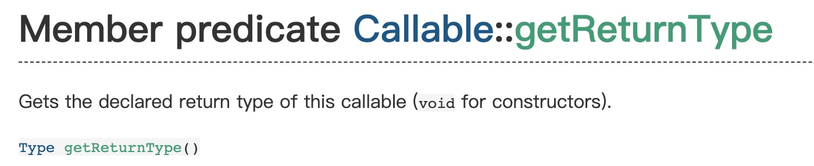
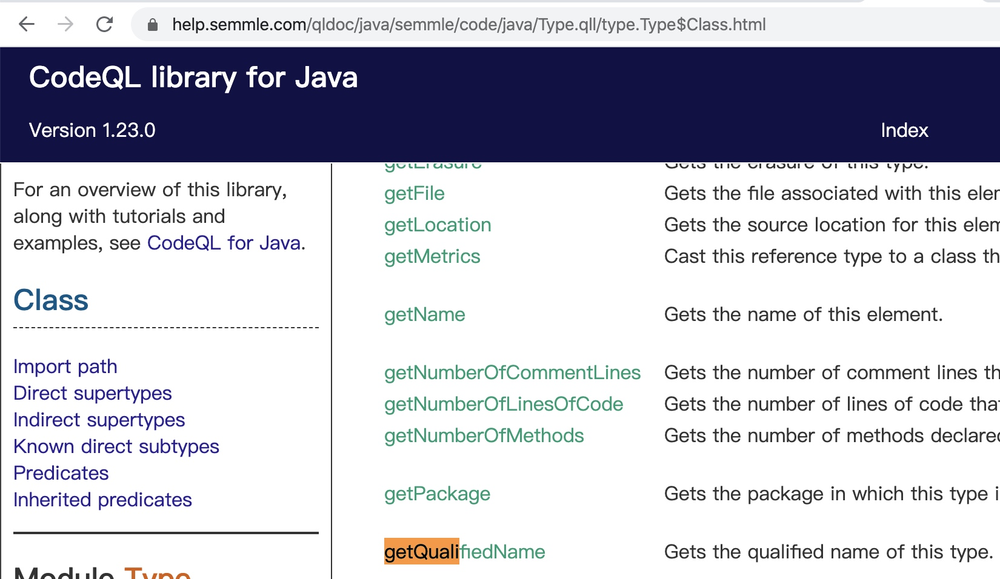

# cast
codeql中的cast用法和别的编程语言一样，只是语法略有不同。相比于`((Foo)x)`，我更喜欢`x.(Foo)`的简洁。

## doc
https://help.semmle.com/QL/ql-handbook/expressions.html?highlight=cast#casts

## example
比如在java中，我想获得一个类方法的返回值的类型的完全路径名，比如以下代码
```
class A {
    public XXX B() {
    }
}
```
我想获的B方法的返回类型XXX的完全路径名，即`com....XXX`这种，很容易想到需要一个类似`getQualifiedName`这种api。首先看看Method提供的api，获得返回类型

它的返回值是一个Type类型，Type类里并没有`getQualifiedName`，但是它的子类Class里有这个api

所以我用cast写个query就能获取完全路径名了：
```
import java

from Method method
where method.isPublic() and
method.getReturnType().toString().indexOf("ValueExpression")>=0
select method,method.getReturnType().(Class).getQualifiedName()
```
