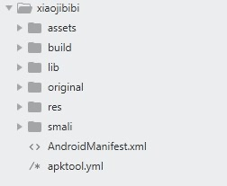
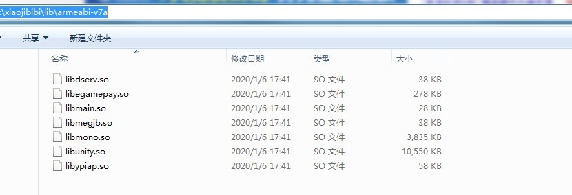

# 对apk在线处理功能的攻击

去年给公司产品做日常review的时候，无意间发现了一个字符串拼接造成的os注入，后来经过测试用同样的攻击手法，同类型的网站有一半都能攻击成功。受影响的厂商已经修复了相关漏洞，本文简单介绍一下攻击过程以及攻击过程中的思考。

## 关于apk
apk是安卓系统上的安装包，本质上是一个加了签名的压缩包。
```
apk = 压缩包 + 签名
```
笔者随便从网上download一个带签名的apk，把它解压（用后面说到的apktool解压）出来后目录结构大概是下面这样。

其中lib目录下有两个文件夹，里面可能会有so文件（也可能没有）

对apk的介绍到此结束。
实际上对apk的攻击应该不止这一个点，笔者还做过其他攻击尝试，虽然没有

## 关于apktool
[apktool](https://github.com/iBotPeaches/Apktool)是一个开源的apk逆向工具，用到本文中介绍的攻击过程几乎和逆向无关，只需要：
解压
```
java -jar apktool.jar d ...
```
压缩
```
java -jar apktool.jar b ...
```

## 关于攻击过程
在“关于apk”中简单介绍了用apktool解压apk后的目录结构，注入点实际上就在so文件的文件名部分，非常简单。

为什么会发现这个点呢，笔者第一次测试的时候没有任何apk、逆向基础；直到测试出rce（到至今），也没有把apk里面所有类型的文件全测一遍。之所以会想到去修改so文件名是第一个出现rce的网站，提供了非常人性化的功能菜单(给开发点赞）。它有一个叫做“so文件保护”的功能，看到这个功能，以及用完这个功能对比了一下处理前后的so文件（确实有变化），笔者思考了一下：
1. 根据前期收集的信息，网站服务端是用php写的。简单google了一下，php没有专门处理so文件的library。
2. so文件是二进制文件，不像文本文件，大概率不会直接用代码去处理，猜测开发可能写了个工具然后在php中直接调用这个外部工具处理。
3. so文件名这个注入点，在apk的lib目录下，并且不是每个apk都必须要有so文件。开发不太容易注意到（模块化开发），测试可能也会忽略这个地方。

综上所述，尝试了一下文件名注入os命令，一发入魂。

## 写在后面
公开这篇文章，是希望未来能看到更多对apk的攻击方式。笔者在rce前后，还尝试了另外两种不同的攻击方式，其中一种甚至需要hack apktool来配合build过程，并且几乎成功（曾经成功，未做记录，功能下线-_-）。

在线处理apk这样的复合文件，安全永远是一个很大的挑战。要做好安全，需要非常清楚复合文件的结构。